<!--
 * @Author: your name
 * @Date: 2020-03-13 11:57:54
 * @LastEditTime: 2020-03-18 11:56:31
 * @LastEditors: Please set LastEditors
 * @Description: In User Settings Edit
 * @FilePath: /inference-engine-doc/main.md
 -->
# 推理引擎设计文档

## 1 Architecture

### Design principle

- 先考虑通用性，再考虑性能
- 对于IR的表示都使用MLIR及其方言
- 清晰的IR分层

### Feature list

整体推理引擎需要支持的功能如下：

- 脱离框架运行，直接读取框架的模型运行
- 支持NHW维度可变，非可变网络运行
- 兼容CNML，CNNL
- 兼容1V，未来的CV库
- 兼容可变，非可变
- 未来兼容训练

​                                                                         图1. 推理引擎架构图

### 框架介绍

图1为推理引擎的整体框架，图中圆形表示的是数据结构，方形表示的是pass或者转换模块。

#### 数据/数据结构

- 模型数据：框架(tf,pytorch)训练出来的模型数据
- IR0：图级别IR，IR0-0~IR0-5表示经过不同pass后IR0的形态，IR0中的参数可能发生变化。
- IR1：带有硬件信息的计算，几乎和mlisa一一对应
- Mem request：描述空间需求的请求序列，可以描述对空间的分配需求，对复用的需求，以及权值的摆数方法
- MLISA：用xoc builder表示的in-memory形式的程序
- MCode：机器码（.o文件）
- AddrTable：根据Mem request生成的运行时可以解读的地址表，可能还包括如何摆数等信息
- 指令：所有kernel指令联合的运行程序

#### 转换/Pass

- Parser & builder：解析图框架的模型数据，构建由IR0构成的图结构
- Shape Infer：形状推导。（去掉Reshape？允许两个算子之间的shape不吻合）
- 图优化：和硬件完全无关的优化
- 融合：TFU融合，前后融合，保证融合一定比不融合好，需要一个比较复杂的策略
- Graph partition：确定一个算子一个kernel（？），如果是则这一步可以进行简化
- 选择实现方式：CNNL，CNML，TFU。简单策略：TFU直接走TFU，剩下的优先命中CNML，最后剩下的走CNNL。CNNL的接口不包含硬件参数，与硬件无关，可以放在IR0层次进行处理。
- Lower：分为两类，单算子的类手写算子生成，以及金字塔生成
- MemReqGen：生成数据/空间需求。包括但不限于：空间使用大小，生命周期，workspace，权值摆放方式
- 指令打包：把生成的很多.o连成一个库

### 遗留问题

1. Plugin的接入方式？是否通过运行时load .o文件，运行时invoke实现？
2. 离线文件的格式?和之前的兼容的话如何做？
3. stack空间如何使用？workspace空间分配到stack上？
4. 是否可以确认不需要把多个算子放在一个kernel launch 中？
5. 控制流如何处理？

## 2 Parser & Builder

@linnan
## 3 IR0
图一级的IR
### 3.1 形态（Op）
（合并过去sopa，ng中重复的图结构）
@linnan @lanhuiying
### 3.2 Pass
#### 算子实现
@linnan @yangyanwu @zhaosheng
#### 控制流
@linnan @yangyanwu @zhaosheng
#### 形状推导
@linnan @yangyanwu @zhaosheng
#### graph partition
@linnan @yangyanwu @zhaosheng
#### 图优化
@lanhuiying
#### 金字塔融合
@lanhuiying
##  4 IR1 
@wangkangyu
### IR1 支持的Op
### CodeGen
mlisa？llvm？bangc？
## 5 指令打包、内存分配

@zhaoyuanyuan

## 6 运行时系统

@linnan @chenliming @wupingping @songaiping

